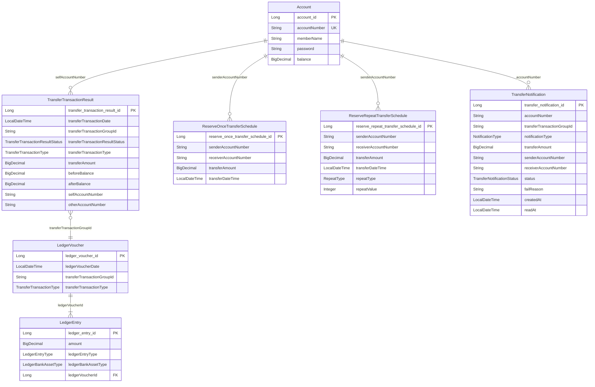

# Bridge Bank Server - 프로젝트 문서

## 목차

1. [프로젝트 개요](#1-프로젝트-개요)
2. [기술 스택](#2-기술-스택)
3. [멀티 모듈 구조](#3-멀티-모듈-구조)
4. [패키지 구조](#4-패키지-구조)
5. [ERD (Entity Relationship Diagram)](#5-erd-entity-relationship-diagram)
6. [엔티티 상세](#6-엔티티-상세)
7. [기능별 상세 흐름](#7-기능별-상세-흐름)
8. [API 엔드포인트](#8-api-엔드포인트)
9. [Kafka 메시징](#9-kafka-메시징)
10. [스케줄러 (Worker)](#10-스케줄러-worker)
11. [핵심 설계 패턴](#11-핵심-설계-패턴)
12. [에러 처리](#12-에러-처리)
13. [검증 (Validation)](#13-검증-validation)
14. [인덱싱 전략](#14-인덱싱-전략)
15. [단순 이체 DB 작업 요약](#15-단순-이체-db-작업-요약)

---

## 1. 프로젝트 개요

Bridge Bank Server는 Spring Boot 기반의 뱅킹 서버 애플리케이션이다. 계좌 관리, 즉시 이체, 예약 이체(1회/반복), 거래 내역 관리, 알림, 복식 부기 원장 기록, 회계 검증 기능을 제공한다.

멀티 모듈 아키텍처로 구성되어 있으며, 핵심 도메인 로직은 `common` 모듈에, REST API 서버는 `core-server` 모듈에, 예약 이체 실행은 별도 워커 모듈(`reserve-once-transfer-worker`, `reserve-repeat-transfer-worker`)에 분리되어 있다.

### 처리 목표

한국의 실제 일평균 은행 거래량을 수용할 수 있는 시스템 구현을 목표로 한다.

| 거래 유형 | 일평균 건수 | 시간당 평균 | 비고 |
|---|---:|---:|---|
| 계좌이체 (즉시 이체) | 약 2,800만 건 | 약 120만 건 | 업무시간 집중 |
| 자동이체 (보험료, 통신료 등) | 약 1,440만 건 | 약 60만 건 | 야간/새벽 배치 비중 높음 |
| 일회성 예약이체 | 약 30만 건 | 약 1.2만 건 | 특정 시점 지정 실행 |

> 상세 시간대별 스케줄 및 처리량 분석은 [성능 분석 및 용량 산정](docs/성능_분석_및_용량_산정.md) 문서를 참고한다.

---

## 2. 기술 스택

| 구분 | 기술 |
|------|------|
| Language | Java 21 |
| Framework | Spring Boot 4.0.3 |
| ORM / SQL | Spring Data JPA + QueryDSL 7.1 + MyBatis 4.0.1 |
| Database | PostgreSQL |
| Cache | Redis |
| Messaging | Apache Kafka |
| API 문서 | springdoc-openapi 3.0.2 (Swagger UI) |
| 모니터링 | Spring Actuator + Micrometer Prometheus |
| 배치 | Spring Batch (core-server) |
| 빌드 | Gradle (멀티 모듈) |
| 테스트 | JUnit 5, Mockito, AssertJ |

---

## 3. 멀티 모듈 구조

```
bridge-bank-server/
├── common/                              # 공유 도메인 로직
│   └── 엔티티, 서비스, 리포지토리, DTO
├── core-server/                         # REST API 서버
│   └── 컨트롤러, 알림, 회계검증, Kafka Consumer, Swagger
├── reserve-once-transfer-worker/        # 1회 예약 이체 워커
│   └── 스케줄러, Kafka Producer
└── reserve-repeat-transfer-worker/      # 반복 예약 이체 워커
    └── 스케줄러, Kafka Producer
```

### 모듈 의존 관계

```
core-server ──────────────┐
reserve-once-transfer-worker ──┤── common
reserve-repeat-transfer-worker ┘
```

- `common`: 모든 모듈이 공유하는 도메인 계층 (엔티티, 서비스, 리포지토리)
- `core-server`: REST API 제공, Kafka Consumer (알림 생성), 회계 검증
- `reserve-once-transfer-worker`: 30초마다 대기 중인 1회 예약 이체를 실행
- `reserve-repeat-transfer-worker`: 30초마다 대기 중인 반복 예약 이체를 실행

---

## 4. 패키지 구조

### common 모듈

```
bridge.bridge_bank/
├── domain/
│   ├── account/
│   │   ├── entity/
│   │   │   └── Account.java
│   │   ├── AccountRepository.java
│   │   └── AccountService.java
│   ├── transfer/
│   │   ├── dto/
│   │   │   └── TransferRequest.java
│   │   └── TransferService.java
│   ├── transfer_transaction_result/
│   │   ├── entity/
│   │   │   ├── TransferTransactionResult.java
│   │   │   ├── TransferTransactionType.java
│   │   │   └── TransferTransactionResultStatus.java
│   │   ├── event/
│   │   │   └── ReserveTransferResultEvent.java
│   │   ├── repository/
│   │   │   ├── TransferTransactionResultRepository.java
│   │   │   ├── TransferTransactionResultQueryRepository.java
│   │   │   └── TransferTransactionResultBulkInsertMapper.java  ← MyBatis
│   │   └── TransferTransactionResultService.java
│   ├── reserve_transfer_schedule/
│   │   ├── once/
│   │   │   ├── entity/
│   │   │   │   └── ReserveOnceTransferSchedule.java
│   │   │   ├── dto/
│   │   │   │   ├── ReserveOnceTransferScheduleCreateRequest.java
│   │   │   │   └── ReserveOnceTransferScheduleTargetOption.java
│   │   │   ├── repository/
│   │   │   │   ├── ReserveOnceTransferScheduleRepository.java
│   │   │   │   └── ReserveOnceTransferScheduleQueryRepository.java
│   │   │   └── ReserveOnceTransferScheduleService.java
│   │   ├── repeat/
│   │   │   ├── entity/
│   │   │   │   ├── ReserveRepeatTransferSchedule.java
│   │   │   │   └── RepeatType.java
│   │   │   ├── dto/
│   │   │   │   ├── ReserveRepeatTransferScheduleCreateRequest.java
│   │   │   │   └── ReserveRepeatTransferScheduleTargetOption.java
│   │   │   ├── repository/
│   │   │   │   ├── ReserveRepeatTransferScheduleRepository.java
│   │   │   │   └── ReserveRepeatTransferScheduleQueryRepository.java
│   │   │   └── ReserveRepeatTransferScheduleService.java
│   │   └── ReserveTransferExecutionService.java
│   └── ledger/
│       ├── entity/
│       │   ├── LedgerVoucher.java
│       │   ├── LedgerEntry.java
│       │   ├── LedgerEntryType.java
│       │   └── LedgerBankAssetType.java
│       ├── repository/
│       │   ├── LedgerVoucherRepository.java
│       │   ├── LedgerEntryRepository.java
│       │   ├── LedgerQueryRepository.java
│       │   └── LedgerBulkInsertMapper.java              ← MyBatis
│       └── LedgerService.java
└── global/
    └── error/
        ├── EntityNotFoundException.java
        ├── PasswordMismatchException.java
        ├── AccessDeniedException.java
        └── InsufficientBalanceException.java
```

### core-server 모듈

```
bridge.bridge_bank/
├── api/
│   ├── controller/
│   │   ├── docs/
│   │   │   ├── AccountControllerDocs.java
│   │   │   ├── TransferControllerDocs.java
│   │   │   ├── TransferTransactionResultControllerDocs.java
│   │   │   ├── ReserveTransferScheduleControllerDocs.java
│   │   │   └── NotificationControllerDocs.java
│   │   ├── AccountController.java
│   │   ├── TransferController.java
│   │   ├── TransferTransactionResultController.java
│   │   ├── ReserveTransferScheduleController.java
│   │   └── NotificationController.java
│   └── dto/
│       ├── AccountCreateRequest.java
│       ├── AccountResponse.java
│       ├── TransferResponse.java
│       ├── TransferTransactionResultResponse.java
│       ├── ReserveOnceScheduleResponse.java
│       ├── ReserveRepeatScheduleResponse.java
│       └── TransferNotificationResponse.java
├── domain/
│   ├── notification/
│   │   ├── entity/
│   │   │   ├── TransferNotification.java
│   │   │   ├── NotificationType.java
│   │   │   └── TransferNotificationStatus.java
│   │   ├── repository/
│   │   │   └── TransferNotificationRepository.java
│   │   └── TransferNotificationService.java
│   └── accounting_validation/
│       ├── entity/
│       │   ├── AccountingValidation.java
│       │   └── AccountingValidationStatus.java
│       └── AccountingValidationService.java
├── infra/
│   └── kafka/
│       ├── ReserveTransferResultEventConsumer.java
│       ├── AccountNotificationEvent.java
│       └── AccountNotificationEventPublisher.java
└── global/
    ├── config/
    │   ├── SwaggerConfig.java
    │   └── AsyncAccountingValidationExecutorConfig.java
    └── error/
        ├── ErrorResponse.java
        └── GlobalExceptionHandler.java
```

### Worker 모듈 (once / repeat 동일 구조)

```
bridge.bridge_bank/
├── domain/
│   └── reserve_transfer_execution/
│       ├── ReserveOnceTransferScheduler.java   (또는 ReserveRepeatTransferScheduler.java)
│       └── ReserveTransferResultEventPublisher.java
└── global/
    └── config/
        └── AsyncReserveTransferOnceExecutorConfig.java   (또는 Repeat)
```

---

## 5. ERD (Entity Relationship Diagram)



### 엔티티 관계 설명

- **Account ↔ TransferTransactionResult**: 계좌번호(selfAccountNumber)로 논리적 연결. 한 계좌에 여러 거래 내역이 존재한다.
- **Account ↔ ReserveOnceTransferSchedule**: senderAccountNumber/receiverAccountNumber로 연결. 한 계좌에서 여러 예약 이체 스케줄을 생성할 수 있다.
- **Account ↔ ReserveRepeatTransferSchedule**: 동일한 패턴으로 연결.
- **Account ↔ TransferNotification**: accountNumber로 연결. 한 계좌에 여러 알림이 존재한다.
- **LedgerVoucher ↔ LedgerEntry**: ledgerVoucherId FK로 연결. 하나의 전표에 2개의 분개(차변/대변)가 기록된다.
- **TransferTransactionResult ↔ LedgerVoucher**: transferTransactionGroupId로 논리적 연결. 거래와 원장 기록을 그룹으로 추적한다.

> **참고**: JPA 연관관계(@ManyToOne, @OneToMany)는 의도적으로 사용하지 않고, 계좌번호/groupId를 통한 논리적 관계로 설계되어 있다. 이는 모듈 간 독립성을 유지하기 위한 설계 결정이다.

---

## 6. 엔티티 상세

### 6.1 Account (계좌)

| 필드 | 타입 | 제약 조건 | 설명 |
|------|------|----------|------|
| id | Long | PK, AUTO_INCREMENT | 계좌 ID |
| accountNumber | String | UNIQUE, NOT NULL | 계좌번호 (타임스탬프 + 랜덤 생성) |
| memberName | String | | 회원 이름 |
| password | String | | 계좌 비밀번호 |
| balance | BigDecimal | | 계좌 잔액 |

### 6.2 TransferTransactionResult (거래 내역)

| 필드 | 타입 | 제약 조건 | 설명 |
|------|------|----------|------|
| id | Long | PK, AUTO_INCREMENT | 거래 내역 ID |
| transferTransactionDate | LocalDateTime | | 거래 일시 |
| transferTransactionGroupId | String | | 거래 그룹 ID (송신/수신 쌍을 묶는 키) |
| transferTransactionResultStatus | Enum | | SUCCESS, FAIL |
| transferTransactionType | Enum | | SIMPLE_TRANSFER_IN/OUT, RESERVE_ONCE_IN/OUT, RESERVE_REPEAT_IN/OUT |
| transferAmount | BigDecimal | | 이체 금액 |
| beforeBalance | BigDecimal | | 이체 전 잔액 |
| afterBalance | BigDecimal | | 이체 후 잔액 |
| selfAccountNumber | String | | 본인 계좌번호 |
| otherAccountNumber | String | | 상대방 계좌번호 |

### 6.3 ReserveOnceTransferSchedule (1회 예약 이체 스케줄)

| 필드 | 타입 | 설명 |
|------|------|------|
| id | Long | PK |
| senderAccountNumber | String | 보내는 계좌번호 |
| receiverAccountNumber | String | 받는 계좌번호 |
| transferAmount | BigDecimal | 이체 금액 |
| transferDateTime | LocalDateTime | 예약 실행 시각 |

### 6.4 ReserveRepeatTransferSchedule (반복 예약 이체 스케줄)

| 필드 | 타입 | 설명 |
|------|------|------|
| id | Long | PK |
| senderAccountNumber | String | 보내는 계좌번호 |
| receiverAccountNumber | String | 받는 계좌번호 |
| transferAmount | BigDecimal | 이체 금액 |
| transferDateTime | LocalDateTime | 다음 실행 시각 |
| repeatType | Enum | MONTHLY, WEEKLY, DAILY, HOURLY |
| repeatValue | Integer | 반복 간격 (예: 2주마다 → WEEKLY, 2) |

### 6.5 LedgerVoucher (원장 전표)

| 필드 | 타입 | 설명 |
|------|------|------|
| id | Long | PK |
| ledgerVoucherDate | LocalDateTime | 전표 생성 일시 |
| transferTransactionGroupId | String | 연관 거래 그룹 ID |
| transferTransactionType | Enum | 거래 유형 |

### 6.6 LedgerEntry (원장 분개)

| 필드 | 타입 | 설명 |
|------|------|------|
| id | Long | PK |
| amount | BigDecimal | 금액 |
| ledgerEntryType | Enum | DEBIT (차변), CREDIT (대변) |
| ledgerBankAssetType | Enum | ASSET (자산), DEBT (부채) |
| ledgerVoucherId | Long | FK → LedgerVoucher |

### 6.7 TransferNotification (이체 알림)

| 필드 | 타입 | 설명 |
|------|------|------|
| id | Long | PK |
| accountNumber | String | 알림 대상 계좌번호 |
| transferTransactionGroupId | String | 연관 거래 그룹 ID |
| notificationType | Enum | TRANSFER_SENT, TRANSFER_RECEIVED, TRANSFER_FAILED |
| transferAmount | BigDecimal | 이체 금액 |
| senderAccountNumber | String | 보내는 계좌번호 |
| receiverAccountNumber | String | 받는 계좌번호 |
| status | Enum | UNREAD, READ |
| failReason | String | 실패 사유 (실패 시) |
| createdAt | LocalDateTime | 생성 일시 |
| readAt | LocalDateTime | 읽은 일시 |

인덱스: `idx_notification_account_status` (accountNumber, status) — 읽지 않은 알림 조회 최적화

---

## 7. 기능별 상세 흐름

### 7.1 계좌 생성

```
클라이언트 → POST /api/accounts
         → AccountController.createAccount()
         → AccountService.createAccount()
         → AccountRepository.save()
         → 201 Created + AccountResponse
```

**흐름:**
1. 클라이언트가 `memberName`, `password`를 전송한다.
2. `Account.create()`가 타임스탬프 + 랜덤 숫자로 계좌번호를 자동 생성한다.
3. 테스트용으로 잔액을 0~1억 사이 랜덤 값으로 설정한다.
4. DB에 저장하고 계좌 정보(비밀번호 제외)를 반환한다.

---

### 7.2 즉시 이체 (Simple Transfer)

```
클라이언트 → POST /api/transfers
         → TransferController.transfer()
         → TransferService.simpleTransferNow()
         ├── AccountService.getTwoAccountsForUpdate()   [SELECT FOR UPDATE]
         ├── 비밀번호 검증
         ├── 잔액 검증
         ├── AccountService.updateAccountBalanceBoth()   [잔액 업데이트]
         ├── TransferTransactionResultService.saveTransferTransactionResultBoth()  [거래 내역 2건 bulk INSERT]
         └── LedgerService.recordForTransfer()           [원장 기록 6건 bulk INSERT]
         → 200 OK
```

**상세 흐름:**
1. 클라이언트가 `senderAccount`, `senderPassword`, `receiverAccount`, `transferAmount`를 전송한다.
2. 보내는 계좌 = 받는 계좌이면 `IllegalArgumentException`을 던진다.
3. **데드락 방지**: 두 계좌를 계좌번호 알파벳 순으로 정렬하여 `SELECT FOR UPDATE` 잠금을 건다.
4. 보내는 계좌의 비밀번호를 검증한다. 불일치 시 `PasswordMismatchException` (401).
5. 잔액 부족 시 `InsufficientBalanceException` (400).
6. **잔액 갱신**: 단일 UPDATE 쿼리로 두 계좌의 잔액을 동시에 갱신한다 (CASE문 사용).
7. **거래 내역**: 송신(OUT)과 수신(IN) 2건의 `TransferTransactionResult`를 MyBatis multi-row INSERT로 한 번에 저장한다. 같은 `transferTransactionGroupId`로 묶인다.
8. **원장 기록**: 복식 부기 원칙에 따라 `LedgerVoucher` 2건과 `LedgerEntry` 4건을 MyBatis multi-row INSERT로 각각 한 번에 기록한다 (아래 [7.7 복식 부기](#77-복식-부기-원장-기록) 참고).

---

### 7.3 1회 예약 이체

#### 7.3.1 스케줄 생성

```
클라이언트 → POST /api/reserve-transfers/once
         → ReserveTransferScheduleController.createOnceSchedule()
         → ReserveOnceTransferScheduleService.createReserveOnceTransferSchedule()
         ├── AccountService.getTwoAccounts()           [계좌 존재 확인]
         ├── 비밀번호 검증
         └── ReserveOnceTransferScheduleRepository.save()
         → 201 Created
```

**흐름:**
1. 보내는/받는 계좌, 금액, 예약 시각을 전송한다.
2. 동일 계좌 검증, 계좌 존재 확인, 비밀번호 확인을 수행한다.
3. 스케줄을 DB에 저장한다. (이 시점에서는 이체를 실행하지 않는다.)

#### 7.3.2 스케줄 실행 (Worker)

```
[30초마다 실행]
ReserveOnceTransferScheduler.executeReserveOnceTransfer()
├── getPendingReserveOnceTransferSchedules(now)   [시각이 지난 스케줄 조회]
├── Union-Find로 계좌 그룹 분류                    [데드락 방지]
├── 그룹별 병렬 실행 (CompletableFuture)
│   └── 그룹 내 순차 실행
│       ├── ReserveTransferExecutionService.executeReserveOnceTransfer()
│       │   ├── TransferService.reserveOnceTransferNow()   [이체 실행]
│       │   ├── 성공 → ReserveTransferResultEvent.success() 생성
│       │   ├── 실패 → ReserveTransferResultEvent.fail() 생성
│       │   └── finally → 스케줄 삭제 (1회이므로)
│       └── ReserveTransferResultEventPublisher.publish()   [Kafka 발행]
└── 모든 Future 완료 대기
```

```
[Kafka: reserve-transfer-result 토픽]
                    ↓
ReserveTransferResultEventConsumer.consume()          [core-server]
└── TransferNotificationService.createNotificationsFromTransferResult()
    ├── TransferNotification.createForSender()        [송신자 알림]
    ├── TransferNotification.createForReceiver()      [수신자 알림 (성공 시)]
    ├── TransferNotificationRepository.saveAll()
    └── AccountNotificationEventPublisher.publish()   [Kafka: account-notification]
```

---

### 7.4 반복 예약 이체

#### 7.4.1 스케줄 생성

즉시 이체 스케줄 생성과 동일하지만, `repeatType`(MONTHLY/WEEKLY/DAILY/HOURLY)과 `repeatValue`(반복 간격)를 추가로 받는다.

#### 7.4.2 스케줄 실행 (Worker)

1회 예약 이체와 동일한 Union-Find 기반 병렬 실행이지만, **finally 블록에서 스케줄을 삭제하는 대신 갱신한다**:

```
renewReserveRepeatTransferSchedule()
├── repeatType에 따라 다음 실행 시각 계산
│   ├── MONTHLY → plusMonths(repeatValue)
│   ├── WEEKLY  → plusWeeks(repeatValue)
│   ├── DAILY   → plusDays(repeatValue)
│   └── HOURLY  → plusHours(repeatValue)
├── 계산된 시각이 현재보다 과거이면 → 미래가 될 때까지 반복 더함
└── transferDateTime 업데이트
```

---

### 7.5 거래 내역 조회

```
클라이언트 → GET /api/accounts/{accountNumber}/transfer-results
         → TransferTransactionResultController.getTransferResults()
         → TransferTransactionResultService.get10TransferTransactionResults()
         → TransferTransactionResultQueryRepository.get10TransferTransactionResults()
         → 200 OK + List<TransferTransactionResultResponse>
```

**흐름:**
1. 클라이언트가 계좌번호로 거래 내역을 요청한다. 선택적으로 `receiverAccountNumber`, `transferTransactionType` 필터를 지정할 수 있다.
2. QueryDSL 동적 쿼리로 `selfAccountNumber` 일치 조건에 선택적 필터를 추가한다.
3. `transferTransactionDate DESC`로 정렬하여 최근 10건을 반환한다.

---

### 7.6 알림 관리

#### 알림 생성 흐름

예약 이체 결과 이벤트(Kafka)를 수신하여 자동으로 알림을 생성한다:

```
Kafka: reserve-transfer-result → ReserveTransferResultEventConsumer
    → TransferNotificationService.createNotificationsFromTransferResult()
    ├── 성공 이벤트:
    │   ├── 송신자 알림: TRANSFER_SENT (status=UNREAD)
    │   └── 수신자 알림: TRANSFER_RECEIVED (status=UNREAD)
    └── 실패 이벤트:
        └── 송신자 알림: TRANSFER_FAILED (status=UNREAD, failReason 포함)
```

알림 생성 후 Kafka `account-notification` 토픽으로 실시간 이벤트를 발행한다 (Bridge Pay 앱으로 푸시).

#### 알림 조회/관리 API

| 기능 | 엔드포인트 |
|------|-----------|
| 전체 알림 조회 | `GET /api/accounts/{accountNumber}/notifications` |
| 읽지 않은 알림 조회 | `GET /api/accounts/{accountNumber}/notifications/unread` |
| 읽지 않은 알림 수 | `GET /api/accounts/{accountNumber}/notifications/unread/count` |
| 알림 읽음 처리 | `PATCH /api/accounts/{accountNumber}/notifications/{id}/read` |
| 전체 읽음 처리 | `PATCH /api/accounts/{accountNumber}/notifications/read-all` |

---

### 7.7 복식 부기 원장 기록

이체 시 은행 회계 기준에 따라 복식 부기를 기록한다:

```
LedgerService.recordForTransfer()
├── MyBatis bulkInsertVouchers (1회 DB 라운드트립, useGeneratedKeys로 ID 반환)
│   ├── Voucher 1 (송신 거래)
│   └── Voucher 2 (수신 거래)
└── MyBatis bulkInsertEntries (1회 DB 라운드트립)
    ├── Voucher 1 → DEBIT  / DEBT   → 고객 부채(예금) 감소
    ├── Voucher 1 → CREDIT / ASSET  → 은행 자산(현금) 감소
    ├── Voucher 2 → DEBIT  / ASSET  → 은행 자산(현금) 증가
    └── Voucher 2 → CREDIT / DEBT   → 고객 부채(예금) 증가
```

**원리**: 은행 입장에서 고객 예금은 부채(DEBT)이다. A가 B에게 이체하면:
- A의 예금(부채) 감소 → 차변(DEBIT) 부채
- A에게서 나간 돈으로 은행 현금(자산) 감소 → 대변(CREDIT) 자산
- B에게 들어온 돈으로 은행 현금(자산) 증가 → 차변(DEBIT) 자산
- B의 예금(부채) 증가 → 대변(CREDIT) 부채

---

### 7.8 회계 검증 (Accounting Validation)

전일 거래에 대한 회계 무결성을 비동기로 검증한다:

```
AccountingValidationService.validateYesterdayAccountingByTransferType()
├── [비동기 병렬 실행 - 3개의 CompletableFuture]
│   ├── 전일 원장 차변(DEBIT) 합계 조회
│   ├── 전일 원장 대변(CREDIT) 합계 조회
│   └── 전일 거래 합계 조회
├── 검증 1: 차변 합계 == 대변 합계  (복식 부기 균형)
├── 검증 2: 대변 합계 == 거래 합계  (원장 ↔ 거래 일치)
└── 불일치 시 ERROR 로그 (회계 무결성 위반 경고)
```

---

## 8. API 엔드포인트

### 8.1 Account (계좌)

| Method | URI | 설명 | 요청 | 응답 |
|--------|-----|------|------|------|
| POST | `/api/accounts` | 계좌 생성 | `AccountCreateRequest` | `201` + `AccountResponse` |
| GET | `/api/accounts/{accountNumber}` | 계좌 조회 | - | `200` + `AccountResponse` |

### 8.2 Transfer (이체)

| Method | URI | 설명 | 요청 | 응답 |
|--------|-----|------|------|------|
| POST | `/api/transfers` | 즉시 이체 | `TransferRequest` | `200 OK` |

### 8.3 Transfer Transaction Result (거래 내역)

| Method | URI | 설명 | 파라미터 | 응답 |
|--------|-----|------|---------|------|
| GET | `/api/accounts/{accountNumber}/transfer-results` | 거래 내역 조회 | `receiverAccountNumber` (선택), `transferTransactionType` (선택) | `List<TransferTransactionResultResponse>` |

### 8.4 Reserve Transfer Schedule (예약 이체 스케줄)

| Method | URI | 설명 | 요청/파라미터 | 응답 |
|--------|-----|------|-------------|------|
| POST | `/api/reserve-transfers/once` | 1회 예약 이체 생성 | `ReserveOnceTransferScheduleCreateRequest` | `201 Created` |
| GET | `/api/accounts/{accountNumber}/reserve-transfers/once` | 1회 예약 이체 조회 | `receiverAccountNumber` (선택) | `List<ReserveOnceScheduleResponse>` |
| DELETE | `/api/reserve-transfers/once/{id}` | 1회 예약 이체 삭제 | - | `204 No Content` |
| POST | `/api/reserve-transfers/repeat` | 반복 예약 이체 생성 | `ReserveRepeatTransferScheduleCreateRequest` | `201 Created` |
| GET | `/api/accounts/{accountNumber}/reserve-transfers/repeat` | 반복 예약 이체 조회 | `receiverAccountNumber` (선택) | `List<ReserveRepeatScheduleResponse>` |
| DELETE | `/api/reserve-transfers/repeat/{id}` | 반복 예약 이체 삭제 | - | `204 No Content` |

### 8.5 Notification (알림)

| Method | URI | 설명 | 파라미터 | 응답 |
|--------|-----|------|---------|------|
| GET | `/api/accounts/{accountNumber}/notifications` | 전체 알림 조회 | `Pageable` | `Page<TransferNotificationResponse>` |
| GET | `/api/accounts/{accountNumber}/notifications/unread` | 읽지 않은 알림 조회 | `Pageable` | `Page<TransferNotificationResponse>` |
| GET | `/api/accounts/{accountNumber}/notifications/unread/count` | 읽지 않은 알림 수 | - | `long` |
| PATCH | `/api/accounts/{accountNumber}/notifications/{id}/read` | 알림 읽음 처리 | - | `200 OK` |
| PATCH | `/api/accounts/{accountNumber}/notifications/read-all` | 전체 읽음 처리 | - | `int` (처리 건수) |

---

## 9. Kafka 메시징

### 9.1 토픽 구성

| 토픽 | Producer | Consumer | 이벤트 |
|------|----------|----------|--------|
| `reserve-transfer-result` | Worker (once/repeat) | core-server | `ReserveTransferResultEvent` |
| `account-notification` | core-server | Bridge Pay (외부) | `AccountNotificationEvent` |

### 9.2 메시지 흐름

```
┌──────────────────────┐     reserve-transfer-result     ┌──────────────┐
│  once-transfer-worker│ ──────────────────────────────→ │              │
└──────────────────────┘                                 │  core-server │
┌──────────────────────┐     reserve-transfer-result     │              │
│repeat-transfer-worker│ ──────────────────────────────→ │              │
└──────────────────────┘                                 │              │
                                                         │              │  account-notification   ┌────────────┐
                                                         │              │ ────────────────────→   │ Bridge Pay │
                                                         └──────────────┘                         └────────────┘
```

### 9.3 이벤트 스키마

#### ReserveTransferResultEvent

```json
{
  "transferTransactionGroupId": "uuid",
  "resultStatus": "SUCCESS | FAIL",
  "transferTransactionType": "ONCE | REPEAT",
  "transferAmount": 50000,
  "senderAccountNumber": "1111111111",
  "receiverAccountNumber": "2222222222",
  "transferTransactionDate": "2026-03-23T10:00:00",
  "failReason": null
}
```

#### AccountNotificationEvent

```json
{
  "notificationId": 1,
  "accountNumber": "1111111111",
  "notificationType": "TRANSFER_SENT | TRANSFER_RECEIVED | TRANSFER_FAILED",
  "transferAmount": 50000,
  "senderAccountNumber": "1111111111",
  "receiverAccountNumber": "2222222222",
  "transferTransactionGroupId": "uuid",
  "failReason": null,
  "createdAt": "2026-03-23T10:00:01"
}
```

### 9.4 Kafka 설정

- **Producer**: `StringSerializer` + `JsonSerializer`, acks=all, retries=3
- **Consumer**: `StringDeserializer` + `JsonDeserializer`, group-id=`bridge-bank-core-server`, auto-offset-reset=earliest
- **신뢰 패키지**: `bridge.bridge_bank.domain.transfer_transaction_result.event`
- **Partition Key**: `senderAccountNumber` (순서 보장용)

---

## 10. 스케줄러 (Worker)

### 10.1 실행 주기

- **1회 예약 이체 워커**: `*/30 * * * * *` (30초마다)
- **반복 예약 이체 워커**: `*/30 * * * * *` (30초마다)

### 10.2 데드락 방지: Union-Find 알고리즘

동시에 여러 예약 이체가 실행될 때, 같은 계좌를 공유하는 이체들이 병렬로 실행되면 데드락이 발생할 수 있다. 이를 방지하기 위해 **Union-Find (Disjoint Set)** 알고리즘을 사용한다:

```
예: 대기 중인 이체 3건
  이체1: A → B
  이체2: B → C
  이체3: D → E

Union-Find 결과:
  그룹1: {이체1, 이체2}  ← A,B,C 계좌를 공유
  그룹2: {이체3}          ← D,E 계좌만 사용

실행:
  그룹1 → 순차 실행 (이체1 완료 후 이체2)  ┐
  그룹2 → 순차 실행 (이체3)                ┘ 병렬
```

### 10.3 스레드 풀 설정

| 워커 | 코어 풀 | 최대 풀 | 큐 용량 | Rejection 정책 |
|------|---------|---------|---------|----------------|
| once-transfer | 3 | 3 | 18 | CallerRunsPolicy |
| repeat-transfer | 3 | 3 | 18 | CallerRunsPolicy |
| accounting-validation | 3 | 3 | 18 | CallerRunsPolicy |

---

## 11. 핵심 설계 패턴

### 11.1 데드락 방지 (Deadlock Prevention)

두 계좌를 동시에 잠글 때, 항상 **계좌번호 알파벳 순**으로 잠금을 획득한다:

```java
// AccountService.getTwoAccountsForUpdate()
if (senderAccountNumber.compareTo(receiverAccountNumber) < 0) {
    firstAccount = lock(senderAccountNumber);    // 먼저 잠금
    secondAccount = lock(receiverAccountNumber);  // 나중에 잠금
} else {
    firstAccount = lock(receiverAccountNumber);
    secondAccount = lock(senderAccountNumber);
}
```

이 패턴은 잠금 순서를 일관되게 유지하여, 서로 다른 트랜잭션이 교차 잠금(A→B vs B→A)하는 상황을 원천 방지한다.

### 11.2 벌크 업데이트 (Bulk Update)

두 계좌의 잔액을 하나의 SQL로 갱신하여 DB 라운드트립을 최소화한다:

```sql
UPDATE account SET balance = CASE
    WHEN account_number = :sender THEN :senderBalance
    WHEN account_number = :receiver THEN :receiverBalance
END
WHERE account_number IN (:sender, :receiver)
```

### 11.3 MyBatis Bulk INSERT

JPA의 `saveAll()`은 `GenerationType.IDENTITY` 전략에서 내부적으로 건별 INSERT를 실행한다. 이를 MyBatis의 multi-row INSERT로 대체하여 DB 라운드트립을 최소화했다:

```
이체 1건당 DB 라운드트립:
  Before (JPA saveAll):  8회 (INSERT 개별 실행)
  After  (MyBatis bulk): 3회 (multi-row VALUES)
```

JPA와 MyBatis는 같은 DataSource를 사용하므로 `@Transactional` 하나로 동일 트랜잭션에 묶인다. 단, MyBatis로 INSERT한 엔티티는 JPA 영속성 컨텍스트에 포함되지 않는다.

| 역할 | 기술 | 이유 |
|------|------|------|
| 쓰기 (bulk INSERT) | MyBatis | multi-row INSERT로 라운드트립 최소화 |
| 조회 (동적 쿼리) | QueryDSL | 타입 안전한 동적 쿼리 |
| 단건 CRUD | JPA Repository | 단순 조회/갱신 |

### 11.4 트랜잭션 그룹 ID (Transfer Transaction Group ID)

하나의 이체에서 발생하는 모든 기록(송신 내역, 수신 내역, 원장 전표)을 UUID 기반 그룹 ID로 연결한다. 이를 통해:
- 송신/수신 거래 내역을 쌍으로 추적할 수 있다.
- 거래 내역 ↔ 원장 기록의 정합성을 확인할 수 있다.

### 11.5 Swagger 인터페이스 분리

컨트롤러 로직과 API 문서를 분리하기 위해, Swagger 어노테이션(@Tag, @Operation, @ApiResponses, @Parameter)은 `docs/` 패키지의 인터페이스에 선언하고, 컨트롤러는 해당 인터페이스를 implements한다:

```
AccountControllerDocs (interface)  ←  Swagger 어노테이션
        ↑ implements
AccountController (class)          ←  비즈니스 로직만
```

---

## 12. 에러 처리

### 12.1 커스텀 예외 계층

| 예외 | HTTP Status | 설명 |
|------|-------------|------|
| `EntityNotFoundException` | 404 Not Found | 엔티티를 찾을 수 없음 |
| `PasswordMismatchException` | 401 Unauthorized | 비밀번호 불일치 |
| `AccessDeniedException` | 403 Forbidden | 접근 권한 없음 |
| `InsufficientBalanceException` | 400 Bad Request | 잔액 부족 (code: INSUFFICIENT_BALANCE) |
| `IllegalArgumentException` | 400 Bad Request | 잘못된 요청 |
| `MethodArgumentNotValidException` | 400 Bad Request | 요청 값 검증 실패 (code: VALIDATION_ERROR) |
| `Exception` | 500 Internal Server Error | 예상치 못한 서버 오류 |

### 12.2 에러 응답 형식

```json
{
  "code": "NOT_FOUND",
  "message": "Account not found : 1234567890",
  "path": "/api/accounts/1234567890",
  "timestamp": "2026-03-23T10:00:00"
}
```

### 12.3 GlobalExceptionHandler

`@RestControllerAdvice`로 전역 예외를 처리하며, `HttpServletRequest`를 통해 요청 URI를 에러 응답에 포함시킨다. 모든 예외는 `@Slf4j`를 통해 서버 로그에도 기록된다.

---

## 13. 검증 (Validation)

### 13.1 요청 DTO 검증

| DTO | 필드 | 어노테이션 |
|-----|------|-----------|
| `AccountCreateRequest` | memberName | `@NotBlank` |
| | password | `@NotBlank` |
| `TransferRequest` | senderAccount | `@NotBlank` |
| | senderPassword | `@NotBlank` |
| | receiverAccount | `@NotBlank` |
| | transferAmount | `@NotNull @Positive` |
| `ReserveOnceTransferScheduleCreateRequest` | (위와 동일) | (위와 동일) |
| | transferDateTime | `@NotNull @Future` |
| `ReserveRepeatTransferScheduleCreateRequest` | (위와 동일) | (위와 동일) |
| | repeatType | `@NotNull` |
| | repeatValue | `@NotNull @Positive` |

### 13.2 컨트롤러 검증

`@Valid` 어노테이션이 적용된 엔드포인트:
- `POST /api/accounts` — `@Valid @RequestBody AccountCreateRequest`
- `POST /api/transfers` — `@Valid @RequestBody TransferRequest`
- `POST /api/reserve-transfers/once` — `@Valid @RequestBody ReserveOnceTransferScheduleCreateRequest`
- `POST /api/reserve-transfers/repeat` — `@Valid @RequestBody ReserveRepeatTransferScheduleCreateRequest`

검증 실패 시 `MethodArgumentNotValidException` → `400 Bad Request` (code: `VALIDATION_ERROR`)로 응답한다.

---

## 14. 인덱싱 전략

### 14.1 엔티티별 인덱스

| 엔티티 | 인덱스 | 컬럼 | 용도 |
|--------|--------|------|------|
| Account | UK (unique) | `account_number` | 계좌번호 조회/잠금 |
| TransferTransactionResult | `idx_ttr_self_account_date` | `self_account_number, transfer_transaction_date DESC` | 계좌별 최근 거래 내역 조회 |
| TransferTransactionResult | `idx_ttr_type_date` | `transfer_transaction_type, transfer_transaction_date` | 유형별 거래 내역 조회 |
| LedgerVoucher | `idx_lv_type_date` | `transfer_transaction_type, ledger_voucher_date` | 회계 검증 시 전일 원장 조회 |
| LedgerEntry | `idx_le_voucher_type` | `ledger_voucher_id, ledger_entry_type` | 전표별 분개 조회 |
| ReserveOnceTransferSchedule | `idx_rost_transfer_date_time` | `transfer_date_time` | 워커가 실행 대상 조회 |
| ReserveOnceTransferSchedule | `idx_rost_sender_account` | `sender_account_number` | 계좌별 예약 이체 조회 |
| ReserveRepeatTransferSchedule | `idx_rrst_transfer_date_time` | `transfer_date_time` | 워커가 실행 대상 조회 |
| ReserveRepeatTransferSchedule | `idx_rrst_sender_account` | `sender_account_number` | 계좌별 예약 이체 조회 |
| TransferNotification | `idx_notification_account_status_created` | `account_number, status, created_at DESC` | 읽지 않은 알림 조회 |
| TransferNotification | `idx_notification_account_created` | `account_number, created_at DESC` | 전체 알림 조회 |

---

## 15. 단순 이체 DB 작업 요약

```
simpleTransferNow() — @Transactional 1개
│
├─ ① SELECT FOR UPDATE (Account 1)             ← 비관적 락
├─ ② SELECT FOR UPDATE (Account 2)             ← 비관적 락
├─ ③ UPDATE Account 2건 (CASE문 1회)
├─ ④ INSERT TransferTransactionResult 2건       (MyBatis bulk 1회)
├─ ⑤ INSERT LedgerVoucher 2건 + RETURNING      (MyBatis bulk 1회)
├─ ⑥ INSERT LedgerEntry 4건                    (MyBatis bulk 1회)
└─ ⑦ COMMIT                                    ← 락 해제

총 6회 SQL + 1회 COMMIT = 7회 DB 라운드트립
```
